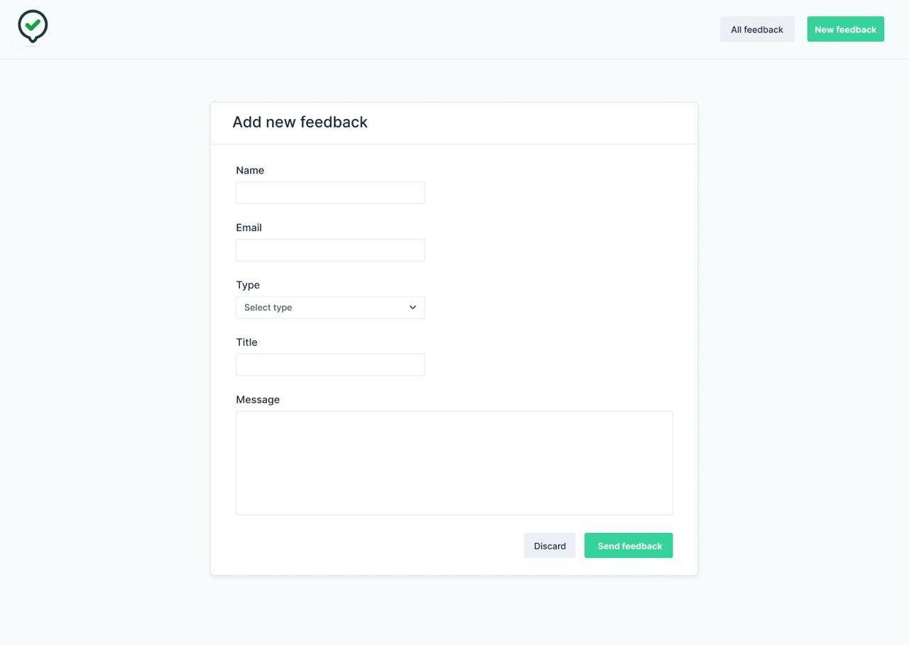

# Simple Feedback Collection

**Objective:**
Create a basic feedback collection form where users can submit feedback. The form will be connected to a backend API that stores feedback entries.

**Requirements:**

- Use of Typescript is **mandatory** both on the Backend and the Frontend
- Integrate the [Figma Design](https://www.figma.com/design/ebZLyASEbFkARn7ByhPgoj/Marker.io-code-exercice?node-id=0%3A1&t=7huffjn5F4p8KIaB-1)

## Frontend

1. **Technologies:** Vue.js, Vite, Tailwind CSS.

2. **Components:**

   - A form to submit feedback with fields: `Name`, `Email`, `Feedback Type` (Bug/Suggestion), and `Message`.
   - A page to display a list of submitted feedback entries.
   - (Bonus) Filter options to filter feedback by type.
   - (Bonus) Sorting options to sort feedback by date or name.

3. **Features:**

   - Validate form inputs.
   - Submit the form data to the backend API.
   - Fetch and display a list of feedback entries from the backend.
   - (Bonus) Implement filtering and sorting of feedback entries.
   - (Bonus) Display feedback entries with pagination.

## Backend

1. **Technologies:** Node.js, TypeScript, MongoDB.
2. **API Endpoints:**
   - `POST /api/feedback` - to submit new feedback.
   - `GET /api/feedback` - to retrieve feedback entries with (Bonus) pagination, filtering, and sorting.
3. **Features:**
   - Store feedback entries in MongoDB.
   - Implement basic validation and error handling on the server side.
   - (Bonus) Support pagination, filtering, and sorting in the retrieval of feedback entries.

## Documentation

Provide clear instructions on how to set up and run the project locally.

## Submission

Submit your solution via a GitHub repository link. The repository should include:

- The complete source code for the frontend and backend.
- A README file with setup instructions.

### Evaluation Criteria

1. **Code Quality:** Clean, readable, and well-structured code following best practices.
2. **Functionality:** Correct implementation of the required features.
3. **Design:** A user-friendly and responsive form.
4. **Documentation:** Clear and comprehensive setup and usage instructions.

## Design

