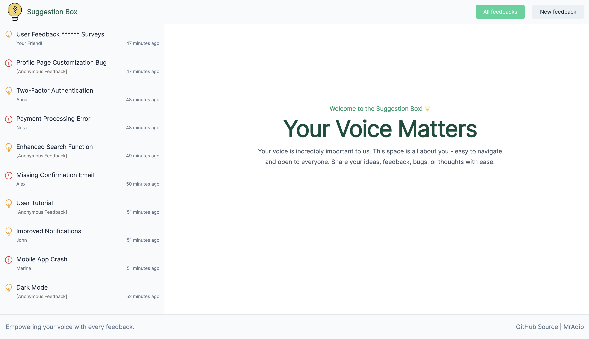
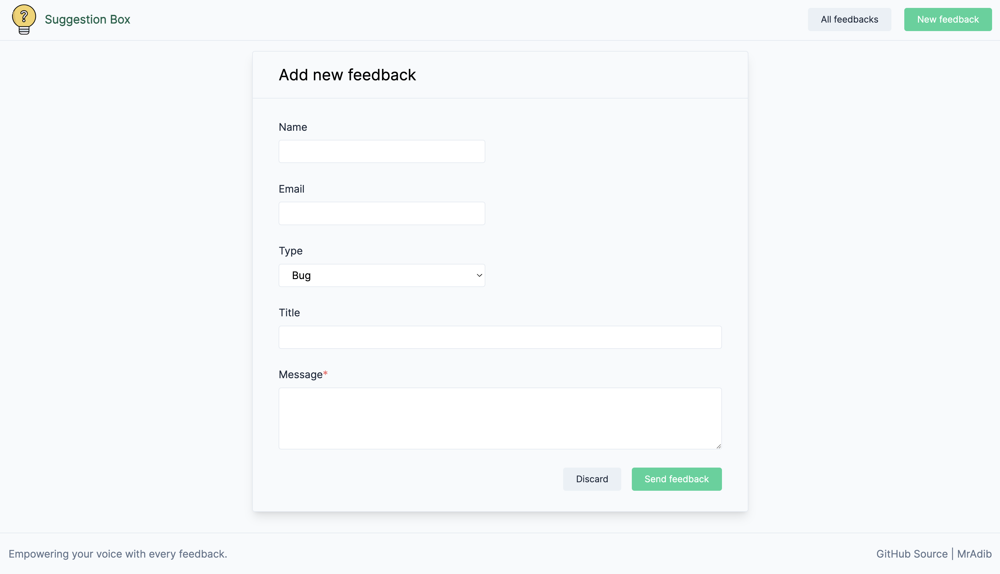

# SuggestionBox

*Suggestion Box* is a simple and intuitive platform that allows users to create and submit bug reports or suggestions. Users can choose to provide their name and email or submit feedback anonymously. SuggestionBox provides a seamless experience to easily submit feedbacks.

## Technologies

Suggestion Box utilizes a modern technology stack to ensure a reliable, efficient, and scalable platform, incorporating the latest tools and best practices in web development for both the backend and frontend.

For deployment, both the frontend and backend of Suggestion Box are containerized using [Docker](https://www.docker.com/products/docker-desktop/). This approach simplifies the setup and deployment process, ensuring consistency across different environments.

The project is structured as a [monorepo](https://monorepo.tools/) using [TurboRepo](https://turbo.build/), enabling developers to work on different parts of the project independently. This setup makes local development simpler and more efficient.

### Backend

- **[Express.js](https://expressjs.com/)**: Fast, unopinionated, minimalist web framework for Node.js.
- **[TypeScript](https://www.typescriptlang.org/)**: Typed superset of JavaScript that compiles to plain JavaScript.
- **[MongoDB](https://www.mongodb.com/)**: NoSQL database for storing data.
- **[Mongoose](https://mongoosejs.com/)**: Elegant MongoDB object modeling for Node.js.
- **[AJV](https://ajv.js.org/)**: JSON Schema Validator for security and reliability of JavaScript applications
- **[Vitest](https://vitest.dev/)**: A blazing fast unit-test framework powered by Vite.
- **[Winston](https://github.com/winstonjs/winston)**: A versatile logging library.
- **[Swagger](https://swagger.io/)**: API documentation tool.
- **[ESLint](https://eslint.org/)**: Pluggable and configurable linter tool for identifying and reporting on patterns in JavaScript.

### Frontend

- **[Vue](https://vuejs.org/)**: The Progressive JavaScript Framework. Version 3.
- **[Nuxt](https://nuxt.com/)**: The Intuitive Vue Framework.
- **[TypeScript](https://www.typescriptlang.org/)**: Typed superset of JavaScript that compiles to plain JavaScript.
- **[Tailwind CSS](https://tailwindcss.com/)**: A utility-first CSS framework for rapid UI development.
- **[ESLint](https://eslint.org/)**: Pluggable and configurable linter tool for identifying and reporting on patterns in JavaScript.
- **[Vitest](https://vitest.dev/)**: A blazing fast unit-test framework powered by Vite.
- **[Storybook](https://storybook.js.org/)**: Frontend workshop for building isolated UI components.

## Install

The project is dockerized for easy installation and deployment.

### 1. Clone the project repository

```bash
git clone https://github.com/JohnAdib/suggestion-box.git
```

### 2. Navigate to the project directory

```bash
cd suggestion-box
```

### 3. Copy the env file

Copy the `env.sample` file in the root directory and rename it to `.env` and if you want edit the `.env` file to set your environment variables as needed.

```bash
cp env.sample .env
```

### 4. Run with Docker

Start the project using Docker. This command will build the necessary Docker images and start the containers in detached mode (`-d`).

```bash
docker-compose up -d
```

If you wann to double check, open Docker Desktop. You should see three containers running under the name `suggestion-box`.

- `mongo` Container for MongoDB database
- `backend` Container for the backend API with Express
- `frontend` Container for the UI with Nuxt

### 5. Access the application

Open your web browser and navigate to [localhost:7020](http://localhost:7020). If you've configured a different port in your `.env` file, replace `7020` with the appropriate port number. You should now see the Suggestion Box application running in your browser.

```text
http://localhost:7020
```




## Run Locally

To run the project locally for development, you can use `npm` and `TurboRepo` to manage both the frontend and backend. Make sure `MongoDB` is installed on your system, or alternatively, you can use Docker to simplify the setup.

First install the project dependencies

```bash
npm i
```

Then run the following command to start both the frontend and backend servers concurrently. This command uses TurboRepo to manage the monorepo structure.

```bash
npm run dev
```

## Future Improvement Checklist

Due to time constraints, some planned features and improvements were not implemented in the current version of Suggestion Box.

- [ ] Add more tests for improved code coverage.
- [ ] Implement Storybook for UI component development.
- [ ] Add pagination functionality in UI.
- [ ] Add filtering functionality in UI.
- [ ] Add sorting functionality in UI.
- [ ] Improve accessibility features.
- [ ] Improve accessibility features.
- [ ] Optimize frontend and backend performance.
- [ ] Integrate CI/CD pipelines for automated deployment.
- [ ] Set page title and description
- [ ] Add social media meta and image
- [ ] Add a favicon for a more polished user experience.
- [ ] Optimize UI codes by moving repeated UI elements into separate components.
- [ ] Implement type checking for TypeScript in Nuxt.
- [ ] Explore additional features based on user feedback.
